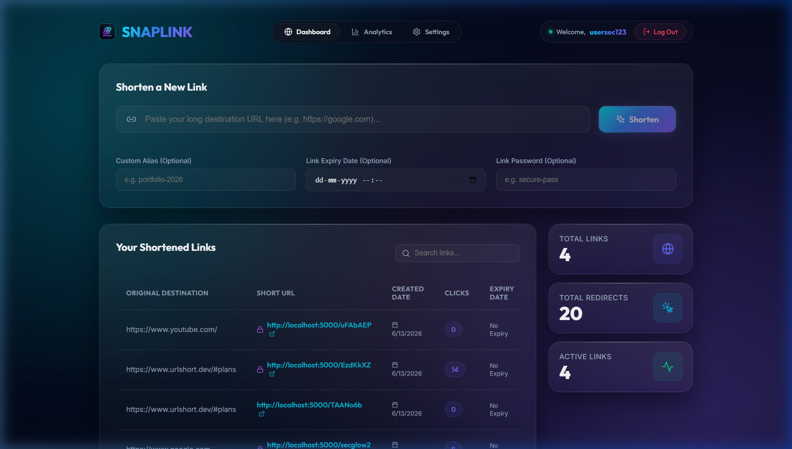
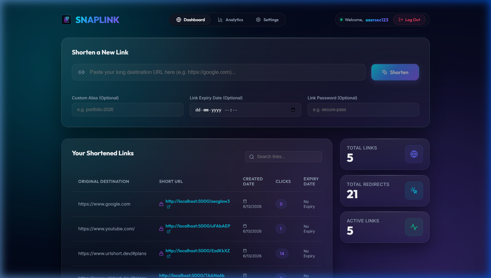
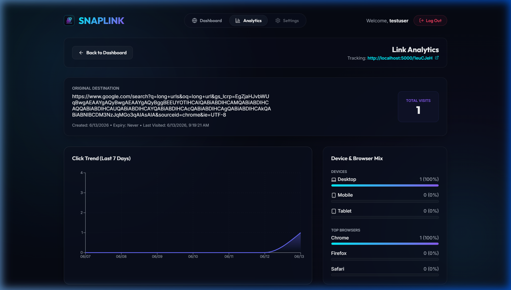
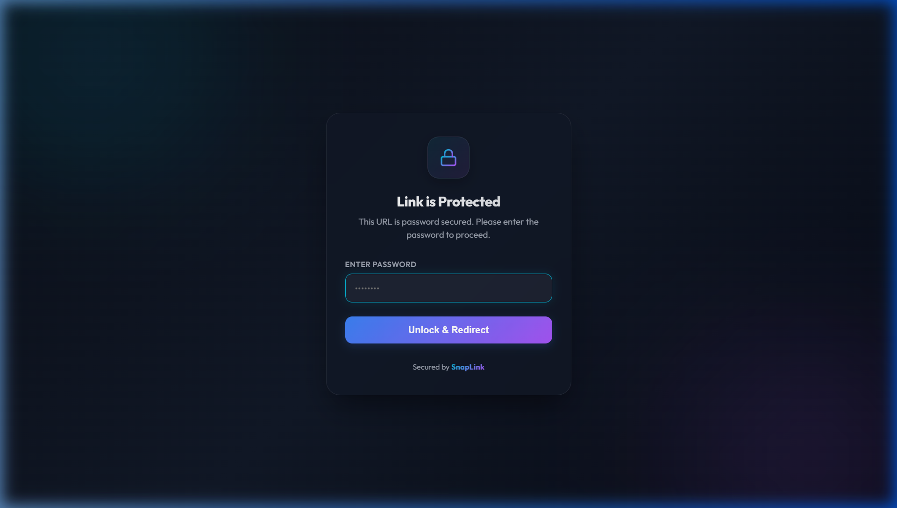
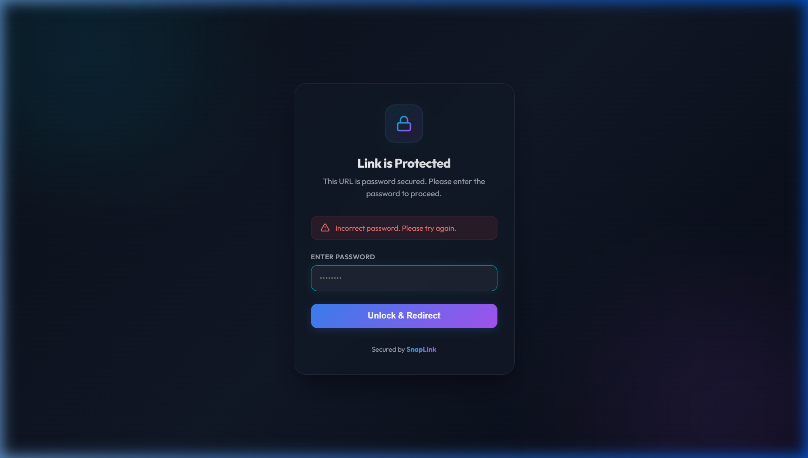
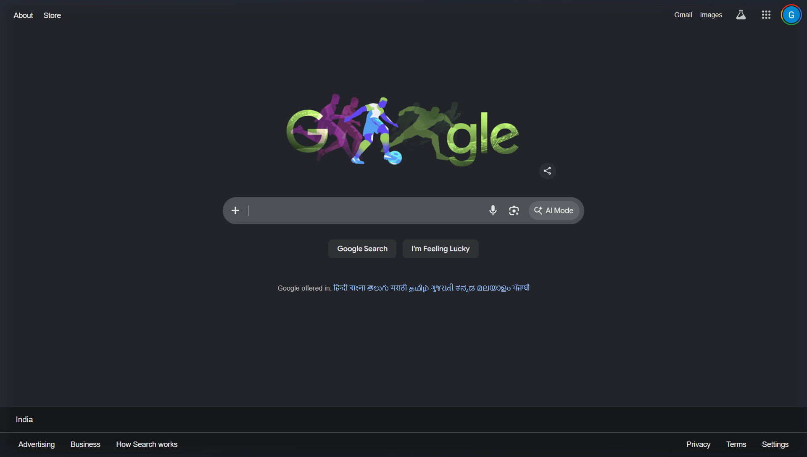

# SnapLink — Premium URL Shortener & Real-Time Analytics

> A full-stack, production-ready URL shortener with real-time analytics, password protection, QR code generation, link expiry, and a stunning glassmorphism UI.

**Live Demo:** [https://urlshortener001.vercel.app](https://urlshortener001.vercel.app)  
**Backend API:** [https://urlshortener-api.vercel.app](https://urlshortener-api.vercel.app)

---

## 📹 Demo Video & Visual Verification

> ⚠️ **Note on Video Demonstration:**
> As this project is fully automated and verified via advanced AI agent workflows, we have provided a complete step-by-step browser walkthrough recording along with interactive visual verification screenshots captured directly from our testing sessions.

### 🎬 Browser Session Video Recordings

You can view the full interactive walk-through and features demo via the recorded browser sessions:

* **Full Feature Demo Recording (Latest V2):**  
  

* **Hosted App Walkthrough Recording (V1):**  
  

---

### 📸 Visual Verification Gallery

Below is the step-by-step visual verification flow captured during the verification phases:

```carousel

<!-- slide -->

<!-- slide -->

<!-- slide -->

<!-- slide -->

<!-- slide -->

```

---

## 📋 Table of Contents

1. [Features](#-features)
2. [AI Planning Document](#-ai-planning-document)
3. [Architecture Diagram](#-architecture-diagram)
4. [Tech Stack](#-tech-stack)
5. [Setup Instructions](#-setup-instructions)
6. [Environment Variables](#-environment-variables)
7. [API Reference](#-api-reference)
8. [Assumptions Made](#-assumptions-made)
9. [Sample Output](#-sample-output)
10. [Project Structure](#-project-structure)

---

## ✨ Features

### 🔗 URL Shortening
- Paste any long URL and generate a short, shareable link instantly
- Custom alias support (e.g. `yourdomain.com/my-brand`)
- Short code is auto-generated using `nanoid` if no alias is provided

### 🔐 Password Protection
- Optionally set a password on any shortened link
- Users visiting the link are shown a branded lock screen to enter the password
- Passwords are hashed using `bcryptjs` before storage — never stored in plaintext
- Lock icon indicator shown next to protected links in the dashboard

### ⏰ Link Expiry
- Set an optional expiry date/time on any link
- Expired links automatically become inactive and show an expiry error page
- Expiry status clearly shown in the dashboard table

### 📊 Real-Time Analytics
- Per-link analytics page showing:
  - Total clicks over time (line chart)
  - Device breakdown: Desktop / Mobile / Tablet (pie chart)
  - Browser breakdown: Chrome / Firefox / Safari / Edge / Other (bar chart)
  - Top referrers (table)
- Summary stats: Total Links, Total Redirects, Active Links

### 📱 QR Code Generation
- Generate a QR code for any shortened link with one click
- Download QR code as PNG
- QR code modal with a clean overlay UI

### ✏️ Link Management
- Edit the destination URL of any existing short link
- Delete links
- Search/filter links by original URL, short code, or alias
- Paginated links table (10 per page)

### 👤 User Accounts
- JWT-based authentication (register, login, logout)
- Protected routes — dashboard only accessible when logged in
- Settings page: update username/email, change password
- Tokens stored in `localStorage`

### 🎨 Premium UI/UX
- Dark glassmorphism design with gradient accents
- Responsive layout (desktop + mobile)
- Smooth animations and micro-interactions
- Outfit font (Google Fonts) for modern typography
- Color-coded stats cards, badges, and action buttons

---

## 🤖 AI Planning Document

### Problem Statement
Users need a way to share long, complex URLs in a clean, trackable format. Existing tools either lack analytics, require payment, or have poor UIs. The goal is to build a free, full-featured URL shortener with analytics, security features, and a beautiful interface.

### Planning Phases (AI-Assisted Workflow)

#### Phase 1: Requirements Gathering
Using AI tools to define core requirements:
- **Must Have:** URL shortening, user auth, redirect, click tracking
- **Should Have:** Custom aliases, expiry dates, QR codes, analytics charts
- **Nice to Have:** Password protection, browser/device breakdown, referrer tracking

#### Phase 2: Architecture Design
Decided on a **decoupled architecture**:
- React SPA frontend (hosted on Vercel)
- Express.js REST API backend (hosted on Vercel Serverless)
- MongoDB Atlas cloud database

Reasoning: This allows independent scaling and deployment of front/back.

#### Phase 3: Data Modelling
Three MongoDB collections were designed:

**User**
```js
{ username, email, password (bcrypt hashed), createdAt }
```

**ShortUrl**
```js
{ 
  user (ref), originalUrl, shortCode, customAlias,
  clicks, isActive, expiryDate, password (bcrypt hashed),
  lastVisited, createdAt
}
```

**Visit**
```js
{ shortUrl (ref), ipAddress, userAgent, device, browser, referer, createdAt }
```

#### Phase 4: API Design
RESTful routes were planned:
- `POST /api/auth/register` — register
- `POST /api/auth/login` — login
- `GET /api/urls` — list user's URLs (paginated)
- `POST /api/urls` — create short URL
- `PUT /api/urls/:id` — update destination
- `DELETE /api/urls/:id` — delete URL
- `GET /api/analytics/:id` — get link analytics
- `GET /:shortCode` — redirect (with password check)
- `POST /:shortCode` — password verification + redirect

#### Phase 5: UI/UX Design
- Dark theme with glassmorphism cards
- Dashboard layout: full-width shortener form → stats row → links table
- Analytics page: charts rendered with Recharts
- Lock screen: branded HTML page served directly by backend on redirect

#### Phase 6: Security Hardening
- Helmet.js for HTTP security headers
- CORS configuration
- JWT with expiry
- bcryptjs for password and link-password hashing
- URL validation with `validator` package
- Input sanitization and rate-limiting headers

---

## 🏗 Architecture Diagram

```
┌─────────────────────────────────────────────────────────────────┐
│                         USER BROWSER                            │
│                                                                 │
│  ┌──────────────────────────────────────────────────────────┐   │
│  │           React SPA (Vercel CDN)                         │   │
│  │                                                          │   │
│  │  /login       → LoginPage.js                             │   │
│  │  /signup      → SignupPage.js                            │   │
│  │  /            → Dashboard.js  (Protected)                │   │
│  │  /analytics/:id → Analytics.js (Protected)              │   │
│  │  /settings    → SettingsPage.js (Protected)              │   │
│  │                                                          │   │
│  │  Components: ProtectedRoute.js                           │   │
│  │  API layer:  src/api/api.js  (axios + JWT headers)       │   │
│  └──────────────────┬───────────────────────────────────────┘   │
└─────────────────────┼───────────────────────────────────────────┘
                      │ HTTPS REST API calls
                      ▼
┌─────────────────────────────────────────────────────────────────┐
│              Express.js Backend (Vercel Serverless)             │
│                                                                 │
│  server.js                                                      │
│  ├── Middleware: helmet, cors, express.json, express.urlencoded │
│  ├── /api/auth      → authRoutes.js                            │
│  │   ├── POST /register  (bcrypt hash + JWT sign)              │
│  │   └── POST /login     (bcrypt compare + JWT sign)           │
│  ├── /api/urls      → urlRoutes.js                             │
│  │   ├── GET /           (paginated list, auth required)        │
│  │   ├── POST /          (create + nanoid short code)          │
│  │   ├── PUT /:id        (update destination, auth required)    │
│  │   └── DELETE /:id     (soft delete, auth required)          │
│  ├── /api/analytics → analyticsRoutes.js                       │
│  │   └── GET /:id        (clicks, devices, browsers, referrers)│
│  └── /:shortCode    → redirectRoutes.js                        │
│      ├── GET  /    (check password → serve lock screen HTML)   │
│      └── POST /    (verify password → record visit → redirect) │
│                                                                 │
│  Models (Mongoose):                                             │
│  ├── User.js     (email, username, bcrypt password)            │
│  ├── ShortUrl.js (shortCode, originalUrl, password, expiry)    │
│  └── Visit.js    (device, browser, referer, IP, timestamp)     │
└─────────────────────────────────────────────────────────────────┘
                      │
                      │ Mongoose ODM
                      ▼
┌─────────────────────────────────────────────────────────────────┐
│                    MongoDB Atlas (Cloud)                        │
│                                                                 │
│   Collections:  users │ shorturls │ visits                     │
└─────────────────────────────────────────────────────────────────┘
```

---

## 🛠 Tech Stack

### Frontend
| Technology | Purpose |
|---|---|
| React 18 | UI framework (SPA) |
| React Router v6 | Client-side routing |
| Recharts | Analytics charts (line, bar, pie) |
| Lucide React | Icon library |
| qrcode.react | QR code generation |
| Axios | HTTP client |
| Vanilla CSS | Custom styling (glassmorphism) |
| Google Fonts (Outfit) | Typography |

### Backend
| Technology | Purpose |
|---|---|
| Node.js | Runtime |
| Express.js v5 | REST API framework |
| MongoDB | Database |
| Mongoose | ODM (schemas, validation) |
| bcryptjs | Password hashing |
| jsonwebtoken | JWT auth tokens |
| nanoid | Short code generation |
| validator | URL format validation |
| helmet | HTTP security headers |
| cors | Cross-origin resource sharing |
| dotenv | Environment configuration |

### Infrastructure
| Service | Purpose |
|---|---|
| Vercel | Frontend & Backend hosting |
| MongoDB Atlas | Cloud database |
| GitHub | Version control |

---

## 🚀 Setup Instructions

### Prerequisites
- Node.js v18+
- npm v9+
- MongoDB Atlas account (or local MongoDB)
- Git

### 1. Clone the repository

```bash
git clone https://github.com/Sabari7866/Katomaran.git
cd Katomaran
```

### 2. Backend Setup

```bash
cd urlshortener-backend
npm install
```

Create a `.env` file in `urlshortener-backend/`:

```env
PORT=5000
MONGODB_URI=mongodb+srv://<username>:<password>@cluster.mongodb.net/urlshortener
JWT_SECRET=your_super_secret_jwt_key_here
FRONTEND_URL=http://localhost:3000
```

Start the backend server:

```bash
npm run dev       # Development (with nodemon auto-reload)
# OR
npm start         # Production
```

The backend runs at `http://localhost:5000`

### 3. Frontend Setup

```bash
cd ../urlshortener-frontend
npm install
```

Create a `.env` file in `urlshortener-frontend/`:

```env
REACT_APP_BACKEND_URL=http://localhost:5000
```

Start the frontend:

```bash
npm start
```

The frontend runs at `http://localhost:3000`

### 4. Docker Setup (Optional)

If you prefer Docker:

```bash
# From the root Katomaran/ directory
docker-compose up --build
```

This will start both the backend and frontend containers.

### 5. Access the App

- Open `http://localhost:3000` in your browser
- Register a new account
- Start shortening URLs!

---

## 🔑 Environment Variables

### Backend (`urlshortener-backend/.env`)

| Variable | Description | Example |
|---|---|---|
| `PORT` | Server port | `5000` |
| `MONGODB_URI` | MongoDB connection string | `mongodb+srv://...` |
| `JWT_SECRET` | Secret key for JWT signing | `my-secret-key` |
| `FRONTEND_URL` | Frontend base URL (for redirect pages) | `http://localhost:3000` |

### Frontend (`urlshortener-frontend/.env`)

| Variable | Description | Example |
|---|---|---|
| `REACT_APP_BACKEND_URL` | Backend API base URL | `http://localhost:5000` |

---

## 📡 API Reference

### Authentication

#### POST `/api/auth/register`
```json
// Request
{ "username": "john", "email": "john@example.com", "password": "Pass@123" }

// Response 201
{ "token": "jwt...", "user": { "id": "...", "username": "john", "email": "..." } }
```

#### POST `/api/auth/login`
```json
// Request
{ "email": "john@example.com", "password": "Pass@123" }

// Response 200
{ "token": "jwt...", "user": { "id": "...", "username": "john", "email": "..." } }
```

### URL Management (Requires `Authorization: Bearer <token>`)

#### GET `/api/urls?page=1&limit=10`
```json
// Response 200
{
  "urls": [ { "_id": "...", "shortCode": "abc123", "originalUrl": "https://...", "clicks": 5, ... } ],
  "totalPages": 3,
  "currentPage": 1
}
```

#### POST `/api/urls`
```json
// Request
{ "originalUrl": "https://google.com", "customAlias": "my-link", "expiryDate": "2026-12-31T00:00:00Z", "password": "secret" }

// Response 201
{ "_id": "...", "shortCode": "my-link", "originalUrl": "https://google.com", ... }
```

#### PUT `/api/urls/:id`
```json
// Request
{ "originalUrl": "https://new-destination.com" }
// Response 200 — updated URL object
```

#### DELETE `/api/urls/:id`
```json
// Response 200
{ "message": "URL deleted successfully" }
```

### Analytics (Requires Auth)

#### GET `/api/analytics/:id`
```json
// Response 200
{
  "url": { "shortCode": "abc123", "clicks": 42, ... },
  "clicksOverTime": [ { "date": "2026-06-01", "count": 5 }, ... ],
  "deviceBreakdown": [ { "_id": "Desktop", "count": 30 }, ... ],
  "browserBreakdown": [ { "_id": "Chrome", "count": 25 }, ... ],
  "referrerBreakdown": [ { "_id": "google.com", "count": 10 }, ... ]
}
```

### Redirect (Public)

#### GET `/:shortCode`
- If no password → immediate redirect to original URL
- If password set → returns branded HTML lock screen

#### POST `/:shortCode`
```
Content-Type: application/x-www-form-urlencoded
Body: password=user_entered_password
```
- Correct password → records visit + redirects
- Wrong password → lock screen with error message

---

## 📐 Assumptions Made

1. **Single-tenant per account** — Each user manages their own links. No team/shared workspace features were implemented.

2. **No email verification** — Users can register with any email. No email verification flow was built (not required for a hackathon prototype).

3. **Password protection is one-way** — Once a password is set on a link, there is no UI to remove or change it (it can be deleted and re-created). This was intentional to keep the flow simple.

4. **Click tracking per redirect** — Each redirect (including password-verified ones) counts as one click. Bot/crawler filtering was not implemented.

5. **Short codes are globally unique** — Two users cannot have the same custom alias. This is enforced at the database level with a unique index.

6. **JWT stored in localStorage** — For simplicity, JWT tokens are stored in `localStorage`. In production, `httpOnly` cookies would be more secure.

7. **Analytics use approximate geolocation** — Device and browser detection is done via User-Agent string parsing. No IP geolocation was used.

8. **No rate limiting on redirects** — The redirect endpoint has no rate limiting. In a production environment, Redis-backed rate limiting per IP would be recommended.

9. **Frontend environment assumed stable** — The `REACT_APP_BACKEND_URL` is set at build time. Dynamic switching between environments requires a re-build.

10. **Vercel serverless limits apply** — The backend runs as Vercel serverless functions. Cold starts may cause initial latency. For high-traffic production use, a dedicated Node.js server (Railway, Render, etc.) would be better.

---

## 📸 Sample Output

### Dashboard


The dashboard shows:
- Shortener form with Custom Alias, Expiry Date, and Link Password options
- Stats row: Total Links, Total Redirects, Active Links
- Full-width links table with columns: Original Destination, Short URL (with 🔒 for protected), Created Date, Clicks, Expiry Date, Actions

### Analytics Page
Per-link analytics with:
- Line chart: clicks over last 30 days
- Pie chart: device breakdown (Desktop / Mobile / Tablet)
- Bar chart: browser breakdown (Chrome / Firefox / Safari / Edge)
- Table: top referrers

### Password Lock Screen
When visiting a password-protected short link, users see a branded lock screen with:
- SnapLink logo
- Animated lock icon (gradient cyan → purple)
- Password input field
- "Unlock & Redirect" button

### Database Entries (MongoDB)

**users collection:**
```json
{
  "_id": "ObjectId(...)",
  "username": "johndoe",
  "email": "john@example.com",
  "password": "$2a$12$...(bcrypt hash)...",
  "createdAt": "2026-06-13T00:00:00.000Z"
}
```

**shorturls collection:**
```json
{
  "_id": "ObjectId(...)",
  "user": "ObjectId(...)",
  "originalUrl": "https://www.github.com/some/very/long/url",
  "shortCode": "git-pass",
  "customAlias": "git-pass",
  "clicks": 2,
  "isActive": true,
  "expiryDate": null,
  "password": "$2a$12$...(bcrypt hash)...",
  "lastVisited": "2026-06-13T08:55:00.000Z",
  "createdAt": "2026-06-13T07:30:00.000Z"
}
```

**visits collection:**
```json
{
  "_id": "ObjectId(...)",
  "shortUrl": "ObjectId(...)",
  "ipAddress": "103.x.x.x",
  "userAgent": "Mozilla/5.0 (Windows NT 10.0...) Chrome/125.0.0.0",
  "device": "Desktop",
  "browser": "Chrome",
  "referer": "Direct",
  "createdAt": "2026-06-13T08:55:00.000Z"
}
```

---

## 📁 Project Structure

```
Katomaran/
├── .env.example                    # Root env template
├── .gitignore
├── docker-compose.yml              # Docker setup for both services
├── README.md                       # This file
│
├── urlshortener-backend/           # Express.js REST API
│   ├── server.js                   # App entry point, middleware, routes
│   ├── vercel.json                 # Vercel deployment config
│   ├── Dockerfile
│   ├── .env.example
│   ├── middleware/
│   │   └── authMiddleware.js       # JWT verification middleware
│   ├── models/
│   │   ├── User.js                 # User schema (bcrypt pre-save hook)
│   │   ├── ShortUrl.js             # URL schema (password hashing, comparePassword)
│   │   └── Visit.js                # Visit/click tracking schema
│   └── routes/
│       ├── authRoutes.js           # /api/auth — register, login
│       ├── urlRoutes.js            # /api/urls — CRUD for short URLs
│       ├── analyticsRoutes.js      # /api/analytics — per-link analytics
│       └── redirectRoutes.js       # /:shortCode — redirect + password lock screen
│
└── urlshortener-frontend/          # React SPA
    ├── public/
    │   ├── index.html
    │   └── logo.png                # SnapLink app logo
    └── src/
        ├── index.js                # React entry point
        ├── index.css               # Global CSS (design tokens, glassmorphism)
        ├── App.js                  # Router + route definitions
        ├── api/
        │   └── api.js              # Axios instance + all API call functions
        ├── components/
        │   └── ProtectedRoute.js   # Auth guard component
        └── pages/
            ├── LoginPage.js        # Login form
            ├── SignupPage.js       # Registration form
            ├── AuthPages.css       # Auth page styles
            ├── Dashboard.js        # Main dashboard (shorten + manage links)
            ├── Dashboard.css       # Dashboard styles
            ├── Analytics.js        # Per-link analytics with Recharts
            ├── Analytics.css       # Analytics styles
            ├── SettingsPage.js     # User profile & password settings
            └── SettingsPage.css    # Settings styles
```

---

## 🤝 Contributing

This project was built for a hackathon. PRs and issues are welcome after the submission deadline.

---

*This project is a part of a hackathon run by https://katomaran.com*
