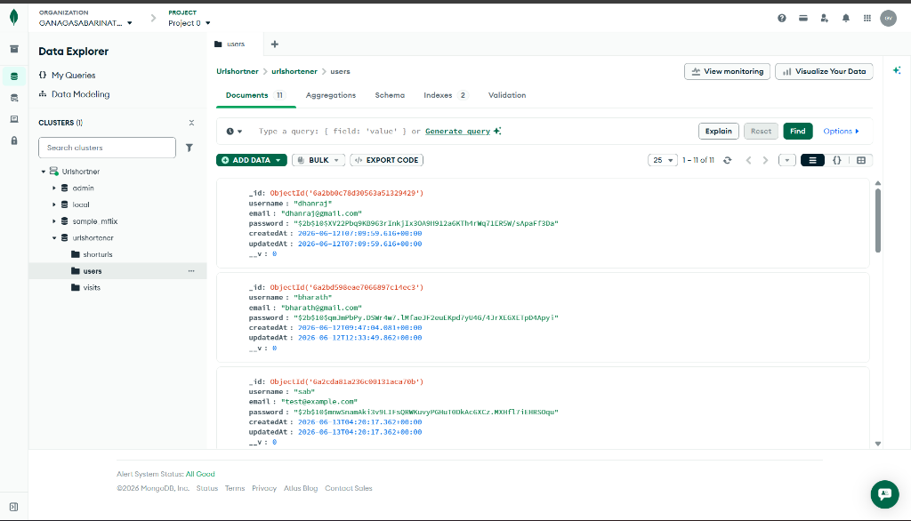
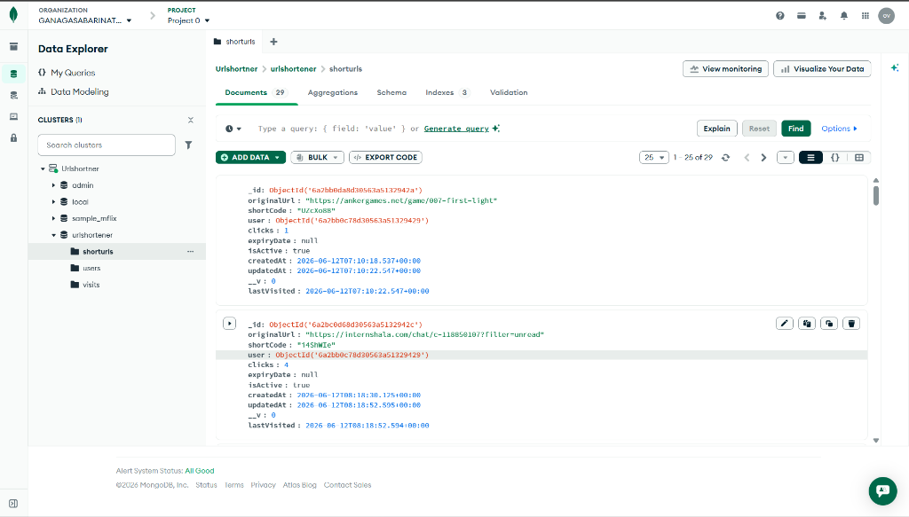

# SnapLink — Visual Walkthrough & Demo

> Complete visual demonstration of the SnapLink URL Shortener application, showcasing all features end-to-end.

---

## 🎬 Full Feature Demo Recording

The recording below demonstrates the complete application workflow — from user registration, URL shortening with custom alias & password protection, analytics dashboard, QR code generation, to link redirection through the branded lock screen.

### Latest Full Feature Demo (V2)

### Hosted App Walkthrough (V1)

---

## 📸 Application Screenshots

### 1. Dashboard — URL Shortener Form & Links Table
The main dashboard with the URL shortener form (Custom Alias, Expiry Date, Password fields always visible), stats summary row, and the full-width links table with action buttons.

### 2. Shortened Link with Lock Icon
After creating a password-protected link, a purple 🔒 lock icon appears next to the short URL in the table, indicating it requires a password to access.

### 3. Analytics Page with Link Switcher
The per-link analytics page showing click trends (line chart), device breakdown (pie chart), browser stats (bar chart), and an interactive dropdown to switch between links.

### 4. Premium Password Lock Screen
When a visitor clicks a password-protected short link, they are shown this branded glassmorphic lock screen with an animated lock icon and password input field.

### 5. Incorrect Password Error State
Entering the wrong password triggers a red error glow animation with a warning message, preventing unauthorized access.

### 6. Successful Redirect
After entering the correct password, the user is seamlessly redirected to the original destination URL, and the visit is recorded in analytics.

---

## 🗄️ Database Entries (MongoDB Atlas)

Live MongoDB Atlas Data Explorer screenshots verifying the stored document schemas:

### Users Collection

### Short URLs Collection

